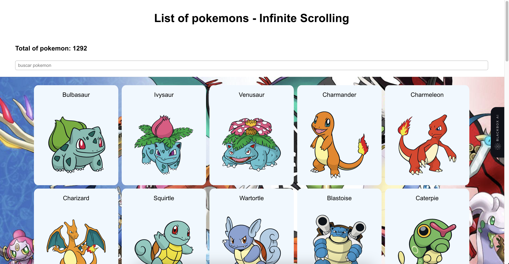

# React TS Poke API Project

This is a React TS project that implements the Poke API for external services. The main feature of this project is the ability to filter by Pokemon name and the implementation of infinite scrolling when you reach the bottom of the page in the browser.

## Installation

To install the necessary dependencies for this project, run the following command in your terminal:

Copy code

`yarn install`

Running the Application
To run the application, use the following command:

Copy code
`yarn start`
This will launch the application in your default web browser.

## Features

- Filter by Pokemon Name
  To filter by Pokemon name, simply type the name of the Pokemon in the search bar located at the top of the page. As you type, the list of Pokemon will update to show only those that match the search criteria.

- Infinite Scroll
  When you reach the bottom of the list of Pokemon, the application will automatically load the next page of Pokemon. This allows for infinite scrolling through the list of available Pokemon.

- API Reference
  This project uses the Poke API for external services. You can find more information about the Poke API at the following link:

Poke API

## Technologies Used

This project was built using the following technologies:

- React TS
- Typescript
- Axios
- SASS
- Unit Testing
- All components and features of this project are thoroughly unit tested using the Jest testing framework.

To run the unit tests, use the following command:

`yarn test`

## Contributing

If you would like to contribute to this project, please submit a pull request or open an issue with your proposed changes.

License
This project is licensed under the MIT License. See the LICENSE file for more information.
